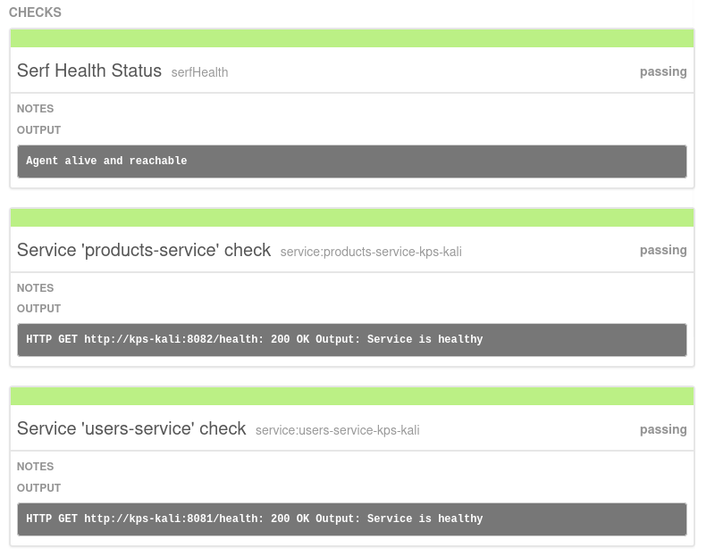
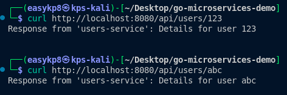
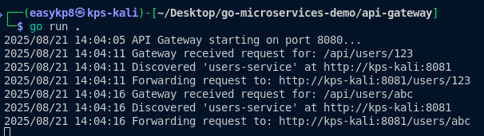

# Go Microservices with Consul Service Discovery

This repository contains the practical work for the Go Microservices module, demonstrating a simple microservices architecture using Go and Consul for service discovery.

## Project Structure

```
go-microservices/
├── users-service/
│   ├── main.go
│   └── go.mod
├── products-service/
│   ├── main.go
│   └── go.mod
├── api-gateway/
│   ├── main.go
│   └── go.mod
└── README.md
```

## Approach

- Built two microservices: `users-service` and `products-service` using Go.
- Implemented an api-gateway to route requests to the appropriate service.
- Used Consul for service registration and health checking.
- Verified service registration and health via the Consul UI.
- Tested endpoints using cURL and Postman.

## Steps Taken

1. Developed each service with its own `main.go` and dependencies.
2. Configured Consul agent in development mode for service discovery.
3. Registered both services with Consul and implemented health checks.
4. Set up the API Gateway to route requests based on the endpoint.
5. Verified service registration and health in the Consul UI.
6. Sent requests to both services via API Gateway using cURL/Postman.
7. Captured terminal output to confirm successful routing.

## Challenges Encountered

- Ensuring correct service registration and health check configuration in Consul.
- Debugging routing logic in the API Gateway.
- Managing dependencies and module paths for each service.

## How to Run

### 1. Start Consul agent:
```bash
consul agent -dev -ui -client=0.0.0.0
```

### 2. Run each service:

**Users Service:**
```bash
cd users-service
go run main.go
```

**Products Service:**
```bash
cd products-service
go run main.go
```

### 3. Start the API Gateway:
```bash
cd api-gateway
go run main.go
```

### 4. Access Consul UI
Navigate to [http://localhost:8500](http://localhost:8500) to view the Consul dashboard.

### 5. Test endpoints using cURL or Postman:

**Test Users Service:**
```bash
curl http://localhost:8080/users/123
```

**Test Products Service:**
```bash
curl http://localhost:8080/products/abc
```

## Screenshots

### Consul UI - Services Registered and Healthy


### cURL/Postman Testing


### API Gateway Terminal Output



## Repository Submission

All code, configuration files, and documentation are included in this repository.

**Repository URL:** [https://github.com/Kinley-pal8/Web303_p2]

## Technologies Used

- **Go**: Programming language for microservices
- **Consul**: Service discovery and health checking
- **HTTP**: REST API communication
- **JSON**: Data exchange format

## Architecture Overview

```
Client Request
     ↓
API Gateway (Port 8080)
     ↓
Service Discovery (Consul)
     ↓
┌─────────────────┬─────────────────┐
│  Users Service  │ Products Service│
│   (Port 8081)   │   (Port 8082)   │
└─────────────────┴─────────────────┘
```

